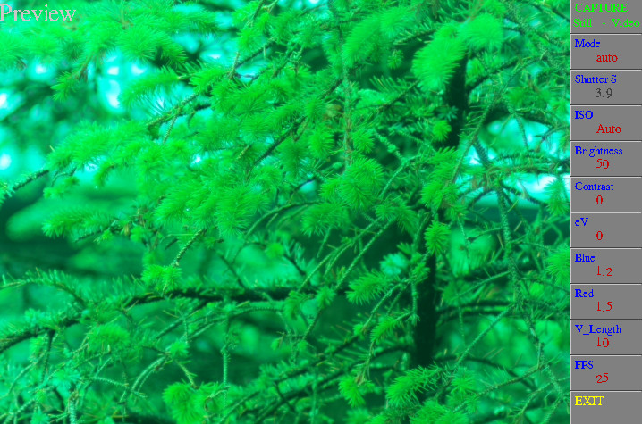

# Pi-Camera-GUI

Script to allow control of a Pi Camera. Will work with all models, v1, v2 & HQ

Shows a reduced preview but saves stills at camera full resolution, and videos at 1440 x 1080.

With a Pi HQ Camera will allow exposures upto 239 seconds.

## Screenshot

