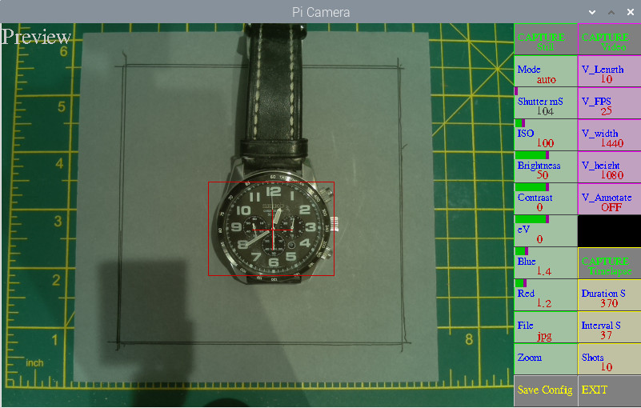

# Pi-Camera-GUI

Script to allow control of a Pi Camera. Will work with all models, v1, v2 & HQ

Shows a reduced preview but saves stills at camera full resolution, and videos at user set rsolution.

With a Pi HQ Camera will allow exposures upto 239 seconds.

Click mouse on the left of a button to decrease, right to increase or use the appropriate slider

Always use the EXIT button to EXIT

Requires opencv installed  sudo apt-get install python3-opencv

## Screenshot

## Zoomed

